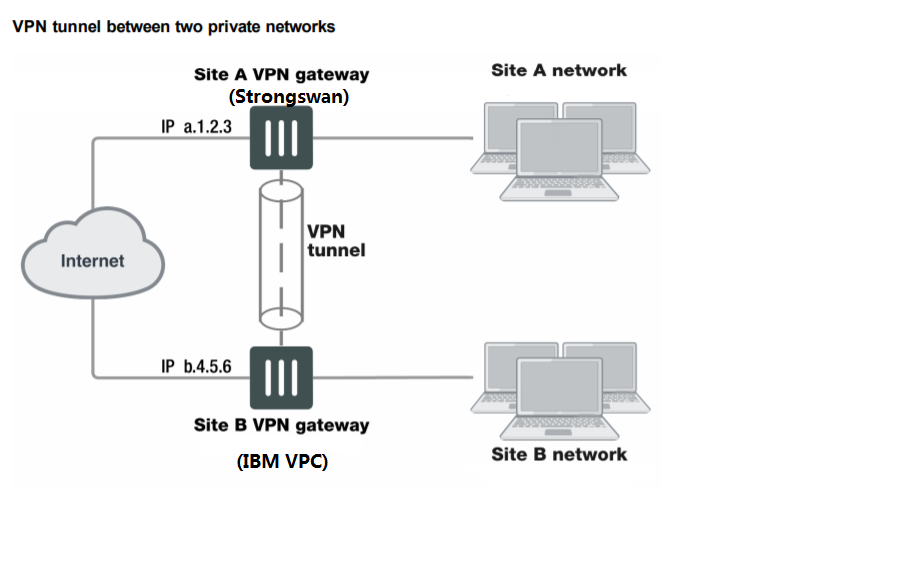

---

copyright:
  years: 2017, 2020
lastupdated: "2020-03-10"

keywords: peering, StrongSwan, connection, secure, Linux, remote, vpc, vpc network

subcollection: vpc-on-classic-network

---

{:shortdesc: .shortdesc}
{:codeblock: .codeblock}
{:screen: .screen}
{:new_window: target="_blank"}
{:pre: .pre}
{:tip: .tip}
{:note: .note}
{:table: .aria-labeledby="caption"}
{:download: .download}


# Creating a secure connection with a remote StrongSwan peer
{: #creating-a-secure-connection-with-a-remote-strongswan-peer}

You can connect a Strongswan peer to a VPN gateway in an existing {{site.data.keyword.cloud}} Virtual Private Cloud (VPC).
{: shortdesc}

These examples are based on Strongswan, version Linux StrongSwan U5.3.5/K4.4.0-133-generic.
{: note}

## Topology
{: #strongswan-architecture}

The following diagram shows a VPN gateway in an IBM Cloud VPC connecting to a StrongSwan peer.



## Before you begin
{: #strongswan-preparation}

To set up your remote Strongswan peer, you need:

* The public IP address of a VPN gateway in a VPC 
* The subnet of the VPN gateway
* The public IP address of the StrongSwan
* The subnet of the StrongSwan that you want to connect using a VPN

## Configuring the StrongSwan peer
{: #to-create-a-secure-connection-with-a-remote-strongswan-peer}

1. Go to **/etc** and create your new custom tunnel configuration file with a name similar to **ipsec.yourName.conf**.

2. Edit **/etc/ipsec.conf** to include **ipsec.yourName.conf** by adding this line:

    `include /etc/ipsec.yourName.conf`

When a VPN peer receives a connection request from a remote VPN peer, it uses IPsec phase 1 parameters to establish a secure connection and authenticate that VPN peer. Then, if the security policy permits the connection, the StrongSwan unit establishes the tunnel using IPsec phase 2 parameters and applies the IPsec security policy. Key management, authentication, and security services are negotiated dynamically through the IKE protocol.

**To support these functions, the following general configuration steps must be performed by the StrongSwan unit:**

* Define the phase 1 parameters that the StrongSwan requires to authenticate the remote peer and establish a secure connection.
* Define the phase 2 parameters that the StrongSwan requires to create a VPN tunnel with the remote peer.

To connect to the IBM Cloud VPC's VPN capability, we recommend the following configuration:
    1. Choose `IKEv2` in authentication;
    2. Enable `DH-group 2` in the Phase 1 proposal
    3. Set `lifetime = 36000` in the Phase 1 proposal
    4. Disable PFS in the Phase 2 proposal
    5. Set `lifetime = 10800` in the Phase 2 proposal
    6. Input your peer's and subnet's information in the Phase 2 proposal

The commands use the following variables:

- `{{ peer_address }}` as the VPN gateway public IP address
- `{{ peer_cidr }}` as the VPN gateway subnet
- `{{ strongswan_address }}` as the Strongswan public IP address
- `{{ strongswan_cidr }}` as the Strongswan subnet

```
    vim /etc/ipsec.yourName.conf
    conn all
           type=tunnel
           auto=route
           #aggressive=no
           esp=aes256-sha256!
           ike=aes128-sha1-modp1024!
           left={{ peer_address }}
           leftsubnet={{ peer_cidr }}
           rightsubnet={{ strongswan_cidr }}
           right={{ strongswan_address }}
           leftauth=psk
           rightauth=psk
           leftid="{{ peer_address }}"
           keyexchange=ikev2
           rightid="{{ strongswan_address }}"
           lifetime=10800s
           ikelifetime=36000s
           dpddelay=30s
           dpdaction=restart
           dpdtimeout=120s
```
{: codeblock}

Set the preshared key in `/etc/ipsec.secrets`

```

# This file holds shared secrets or RSA private keys for authentication.
# e.g. 169.45.74.119 169.61.181.116 : PSK "******"


vim ipsec.secrets

{{ peer_address }} {{ strongswan_address }} : PSK "******"

```
{: screen}

After the configuration file is finished executing, restart the StrongSwan unit.

* Run the following command if you use service: `service ipsec restart`
* Run the following command if you use systemd: `systemctl restart ipsec`

## Configuring the VPN gateway
{: #strongswan-to-create-a-secure-connection-with-the-local-ibm-cloud-vpc}

* To create a secure connection, create the VPN connection within your VPC, which is similar to the 2 VPC example.
* Create a VPN gateway on your VPC subnet, along with a VPN connection between the VPC and the StrongSwan, setting `local_cidrs` to the subnet value on the VPC, and `peer_cidrs` to the subnet value on the StrongSwan.

The gateway status appears as `pending` while the VPN gateway is being created, and the status becomes `available` once creation is complete. Creation may take some time.
{: note}


## Checking the status of the secure connection
{: #strongswan-check-the-status-for-a-secure-connection}

You can check the status of your connection through the IBM Cloud console. Also, you could try to do a `ping` from site to site using the VSIs.


