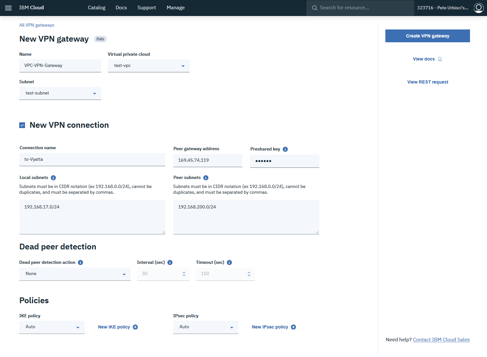

---

copyright:
  years: 2017, 2018, 2019
lastupdated: "2019-05-14"

keywords: peering, Vyatta, connection, secure, remote, vpc, vpc network

subcollection: vpc-on-classic-network

---

{:shortdesc: .shortdesc}
{:codeblock: .codeblock}
{:screen: .screen}
{:new_window: target="_blank"}
{:pre: .pre}
{:tip: .tip}
{:note: .note}
{:table: .aria-labeledby="caption"}
{:download: .download}


# Creating a secure connection with a remote Vyatta peer
{: #creating-a-secure-connection-with-a-remote-vyatta-peer}

This document is based on Vyatta version: AT&T vRouter 5600 1801d.

The example steps that follow skip the prerequisite steps of using {{site.data.keyword.cloud}} API or CLI to create Virtual Private Clouds. For more information, see [Getting Started](/docs/vpc-on-classic?topic=vpc-on-classic-getting-started) and [VPC setup with APIs](/docs/vpc-on-classic?topic=vpc-on-classic-creating-a-vpc-using-the-rest-apis).

## Example steps
{: #vyatta-example-steps}

The topology for connecting to the remote Vyatta peer is similar to creating a VPN connection between two {{site.data.keyword.cloud_notm}} VPCs. However, one side is replaced by the Vyatta unit.


### To create a secure connection with the remote Vyatta peer
{: #vyatta-to-create-a-secure-connection-with-the-remote-vyatta-peer}

When a VPN peer receives a connection request from a remote VPN peer, it uses IPsec Phase 1 parameters to establish a secure connection and authenticate that VPN peer. Then, if the security policy permits the connection, the Vyatta unit establishes the tunnel using IPsec Phase 2 parameters and applies the IPsec security policy. Key management, authentication, and security services are negotiated dynamically through the IKE protocol.

You can go to the Vyatta command line to configure the IPsec tunnel, or you can upload a `*.vcli` file to load your configuration.

**To support these functions, the following general configuration steps must be performed by the Vyatta unit:**

* Define the Phase 1 parameters that the Vyatta unit requires to authenticate the remote peer and establish a secure connection.

* Define the Phase 2 parameters that the Vyatta unit requires to create a VPN tunnel with the remote peer.

To connect to the IBM Cloud VPC's VPN capability, we recommend the following configuration:

1. Choose `IKEv2` in authentication;
2. Enable `DH-group 2` in the Phase 1 proposal
3. Set `lifetime = 36000` in the Phase 1 proposal
4. Disable PFS in the Phase 2 proposal
5. Set `lifetime = 10800` in the Phase 2 proposal
6. Input your peers and subnets information in the Phase 2

```
vim vyatta_temp/create_vpn.vcli
#!/bin/vcli -f
configure

set security vpn ipsec ike-group 169.61.161.151_test_ike
set security vpn ipsec ike-group 169.61.161.151_test_ike dead-peer-detection timeout 120
set security vpn ipsec ike-group 169.61.161.151_test_ike lifetime 36000
set security vpn ipsec ike-group 169.61.161.151_test_ike ike-version 2

set security vpn ipsec ike-group 169.61.161.151_test_ike proposal 1
set security vpn ipsec ike-group 169.61.161.151_test_ike proposal 1 dh-group 2
set security vpn ipsec ike-group 169.61.161.151_test_ike proposal 1 encryption aes256
set security vpn ipsec ike-group 169.61.161.151_test_ike proposal 1 hash sha2_256
set security vpn ipsec esp-group 169.61.161.151_test_ipsec compression disable
set security vpn ipsec esp-group 169.61.161.151_test_ipsec lifetime 10800
set security vpn ipsec esp-group 169.61.161.151_test_ipsec mode tunnel
set security vpn ipsec esp-group 169.61.161.151_test_ipsec pfs disable


set security vpn ipsec esp-group 169.61.161.151_test_ipsec proposal 1 encryption aes256
set security vpn ipsec esp-group 169.61.161.151_test_ipsec proposal 1 hash sha2_256
set security vpn ipsec site-to-site peer 169.61.161.151 authentication mode pre-shared-secret
set security vpn ipsec site-to-site peer 169.61.161.151 authentication pre-shared-secret ******
set security vpn ipsec site-to-site peer 169.61.161.151 ike-group 169.61.161.151_test_ike
set security vpn ipsec site-to-site peer 169.61.161.151 default-esp-group 169.61.161.151_test_ipsec
set security vpn ipsec site-to-site peer 169.61.161.151 description "automation test"
set security vpn ipsec site-to-site peer 169.61.161.151 local-address 169.45.74.119
set security vpn ipsec site-to-site peer 169.61.161.151 connection-type initiate


set security vpn ipsec site-to-site peer 169.61.161.151 tunnel 1 local prefix 192.168.200.0/24
set security vpn ipsec site-to-site peer 169.61.161.151 tunnel 1 remote prefix 192.168.17.0/28

commit
```
{: screen}

Then, you can upload this `*.vcli` file to the Vyatta using SCP, to apply the configuration.

`scp example.vcli <vyatta_username>@<vyatta_ip>`

### To create a secure connection with the local IBM Cloud VPC
{: #vyatta-to-create-a-secure-connection-with-the-local-ibm-cloud-vpc}

 To create a secure connection, you'll create the VPN connection within your VPC, which is similar to the 2 VPC example.

* Create a VPN gateway on your VPC subnet  along with a VPN connection between the VPC and the Vyatta unit, setting `local_cidrs` to the subnet value on the VPC, and `peer_cidrs` to the subnet value on the Vyatta unit.

The gateway status appears as `pending` while the VPN gateway is being created, and the status becomes `available` once creation is complete. Creation may take some time.
{: note}



### Check the status of the secure connection
{: #vyatta-check-the-status-of-the-secure-connection}

You can check the status of your connection through the {{site.data.keyword.cloud_notm}} console. Also, you can try to do a `ping` from site to site using the VSIs.


