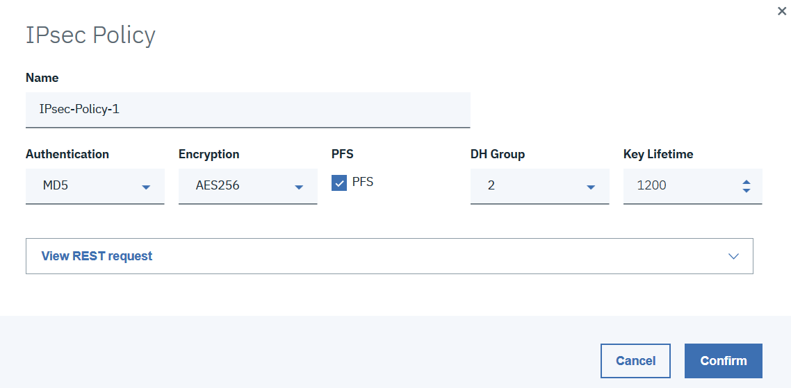

---

copyright:
  years: 2017, 2020
lastupdated: "2020-03-10"

keywords: peering, Juniper, vSRX, connection, secure, remote, vpc, vpc network

subcollection: vpc-on-classic-network

---

{:shortdesc: .shortdesc}
{:codeblock: .codeblock}
{:screen: .screen}
{:new_window: target="_blank"}
{:pre: .pre}
{:tip: .tip}
{:important: .important}
{:table: .aria-labeledby="caption"}
{:download: .download}
{:note: .note}
{:DomainName: data-hd-keyref="DomainName"}


# Creating a secure connection with a remote Juniper vSRX peer
{: #creating-a-secure-connection-with-a-remote-juniper-vsrx-peer}

You can connect a Juniper vSRX peer to a VPN gateway in an existing {{site.data.keyword.cloud}} Virtual Private Cloud (VPC).
{: shortdesc}

These examples are based on Juniper vSRX, JUNOS Software Release [15.1X49-D123.3].
{: note}

## Topology
{: #juniper-architecture}

The following diagram shows a VPN gateway in an IBM Cloud VPC connecting to a Juniper vSRX peer.


## Configuring the Juniper vSRX peer
{: #to-create-a-secure-connection-with-a-remote-vsrx-peer}

When a VPN peer receives a connection request from a remote VPN peer, it uses IPsec Phase 1 parameters to establish a secure connection and authenticate that VPN peer. Then, if the security policy permits the connection, the Juniper vSRX unit establishes the tunnel using IPsec Phase 2 parameters and applies the IPsec security policy. Key management, authentication, and security services are negotiated dynamically through the IKE protocol.

**To support these functions, the following general configuration steps must be performed by the Juniper vSRX unit:**

* Define the Phase 1 parameters that the Juniper vSRX requires to authenticate the remote peer and establish a secure connection.
* Define the Phase 2 parameters that the Juniper vSRX requires to create a VPN tunnel with the remote peer.

To connect to the IBM Cloud VPC's VPN capability, we recommend the following configuration:

* Choose `IKEv1` in phase 1;
* Set up policy mode, not route mode;
* Enable `DH-group 2` in the Phase 1 proposal
* Set `lifetime = 36000` in the Phase 1 proposal
* Enable PFS in the Phase 2 proposal
* Set `lifetime = 10800` in the Phase 2 proposal
* Input your peer's and subnet's information in the Phase 2 proposal
* Allow UDP 500 traffic on external interface.

Juniper vSRX supports IKEv2 in _route mode_ only. Therefore, if you set up IKEv2 in policy mode, you'll see the error `IKEv2 requires bind-interface configuration as only route-based is supported`. However, IBM Cloud VPC VPNaaS currently supports _policy mode_ only, so you must set up IKEv1 in Phase 1 to use the Juniper vSRX.
{: important}

By default, IBM Cloud VPC VPNaaS disables PFS in Phase 2, and vSRX requires PFS to be _enabled_ in Phase 2. For this reason, you must create a new IPsec policy to replace the default policy on the VPC VPNaaS side.
{: important}

Log in to the Juniper vSRX to configure it using SSH.

**The following is an example of how to set up security:**

```
proposal proposal-ike1 {
    authentication-method pre-shared-keys;
    dh-group group2;
    authentication-algorithm sha1;
    encryption-algorithm aes-128-cbc;
    lifetime-seconds 28800;
}
policy ike-policy1 {
    mode main;
    proposals proposal-ike1;
    pre-shared-key ascii-text "your_psk"
}
gateway ibm-vpc-vpn-gw {
    ike-policy ike-policy1;
    address 169.61.227.228;
    local-identity inet 129.146.215.142;
    remote-identity inet 169.61.227.228;
    external-interface ge-0/0/0.0;
}
proposal ipsec-proposal1 {
    protocol esp;
    authentication-algorithm hmac-sha1-96;
    encryption-algorithm aes-128-cbc;
    lifetime-seconds 3600;
}
policy ipsec-policy1 {
    proposals ipsec-proposal1;
}
vpn ibm_vpc {
    bind-interface st0.1;
    df-bit clear;
    ike {
        gateway ibm-vpc-vpn-gw;
        ipsec-policy ipsec-policy1;
    }
    traffic-selector pair1 {
        local-ip 172.29.6.0/23;
        remote-ip 100.64.28.0/25;
    }
    traffic-selector pair2 {
        local-ip 172.29.6.0/23;
        remote-ip 100.64.28.128/26;
    }
    establish-tunnels immediately;
}
interfaces {
    st0 {
        unit 1 {
            description Tunnel-to-IBM-VPC;
            family inet {
            }
        }
}
security {
    flow {
        tcp-mss {
            ipsec-vpn {
                mss 1360;
            }
}

[edit]

```
{: codeblock}

**The following is an example of how to set up the firewall:**

```
admin@Juniper-vSRX# show firewall filter PROTECT-IN term VPN_IKE
from {
    destination-address {
        169.61.195.195/32;
        10.93.160.12/32;
    }
    protocol udp;
    port 500;
}
then accept;

[edit]
```
{: codeblock}

**After the configuration file has finished executing, you may check the connection status from the CLI, with the following command:**

```
 run show security ipsec security-associations
```
{: codeblock}

## Configuring the VPN gateway
{: #vsrx-to-create-a-secure-connection-with-the-local-ibm-cloud-vpc}

To create a secure connection, you'll create the VPN connection within your VPC, which is similar to the two VPC example.

Remember, you must enable PFS in Phase 2, so you must create a new IPsec policy before you create a connection.
{: important}



Create a VPN gateway on your VPC subnet, along with a VPN connection between the VPC and the Juniper vSRX, setting `local_cidrs` to the subnet value on the VPC, and `peer_cidrs` to the subnet value on the Juniper vSRX.

The gateway status appears as `pending` while the VPN gateway is being created, and the status becomes `available` once creation is complete. Creation may take some time.
{:note}


## Checking the status of the secure connection
{: #vsrx-check-the-status-for-a-secure-connection}

You can check the status of your connection through the IBM Cloud console. Also, you could try to do a `ping` from site to site using the VSIs.


