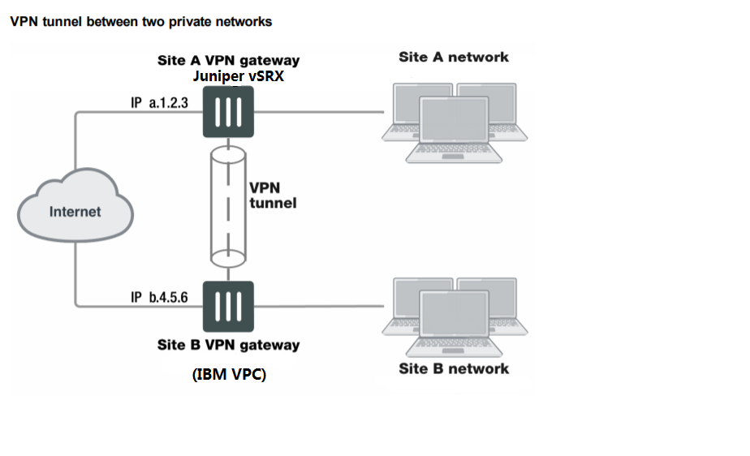
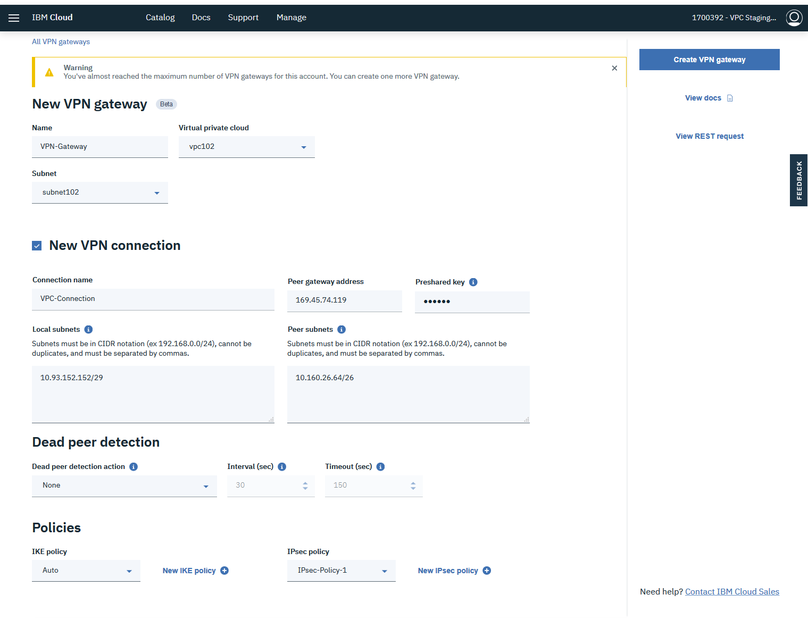

---

copyright:
  years: 2017, 2018, 2019
lastupdated: "2019-05-14"

keywords: peering, Juniper, vSRX, connection, secure, remote

subcollection: vpc-on-classic-network

---

{:shortdesc: .shortdesc}
{:codeblock: .codeblock}
{:screen: .screen}
{:new_window: target="_blank"}
{:pre: .pre}
{:tip: .tip}
{:important: .important}
{:table: .aria-labeledby="caption"}
{:download: .download}
{:note: .note}
{:DomainName: data-hd-keyref="DomainName"}


# Creating a secure connection with a remote Juniper vSRX peer
{: #creating-a-secure-connection-with-a-remote-juniper-vsrx-peer}

This document is based on Juniper vSRX, JUNOS Software Release [15.1X49-D123.3].

The example steps that follow skip the prerequisite steps of using {{site.data.keyword.cloud}} API or CLI to create Virtual Private Clouds. For more information, see [Getting Started](/docs/vpc-on-classic?topic=vpc-on-classic-getting-started) and [VPC setup with APIs](/docs/vpc-on-classic?topic=vpc-on-classic-creating-a-vpc-using-the-rest-apis).

## Example steps
{: #vsrx-example-steps}

The topology for connecting to the remote Juniper vSRX peer is similar to [creating a VPN connection between two VPCs](/docs/vpc-on-classic-network?topic=vpc-on-classic-network---beta-using-vpn-with-your-vpc). However, one side of the connection is replaced by the Juniper vSRX unit.



### To create a secure connection with a remote Juniper vSRX peer
{: #to-create-a-secure-connection-with-a-remote-vsrx-peer}

When a VPN peer receives a connection request from a remote VPN peer, it uses IPsec Phase 1 parameters to establish a secure connection and authenticate that VPN peer. Then, if the security policy permits the connection, the Juniper vSRX unit establishes the tunnel using IPsec Phase 2 parameters and applies the IPsec security policy. Key management, authentication, and security services are negotiated dynamically through the IKE protocol.

**To support these functions, the following general configuration steps must be performed by the Juniper vSRX unit:**

* Define the Phase 1 parameters that the Juniper vSRX requires to authenticate the remote peer and establish a secure connection.
* Define the Phase 2 parameters that the Juniper vSRX requires to create a VPN tunnel with the remote peer.
To connect to the IBM Cloud VPC's VPN capability, we recommend the following configuration:

1. Choose `IKEv1` in phase 1;
2. Set up policy mode, not route mode;
3. Enable `DH-group 2` in the Phase 1 proposal
4. Set `lifetime = 36000` in the Phase 1 proposal
5. Enable PFS in the Phase 2 proposal
6. Set `lifetime = 10800` in the Phase 2 proposal
7. Input your peer's and subnet's information in the Phase 2 proposal
8. Allow UDP 500 traffic on external interface.

#### Known limitations
{: #vsrx-known-limitations}

* Juniper vSRX supports IKEv2 in _route mode_ only. Therefore, if you set up IKEv2 in policy mode, you'll see the error `IKEv2 requires bind-interface configuration as only route-based is supported`. However, IBM Cloud VPC VPNaaS currently supports _policy mode_ only, so you must set up IKEv1 in Phase 1 to use the Juniper vSRX.

* By default, IBM Cloud VPC VPNaaS disables PFS in Phase 2, and vSRX requires PFS to be _enabled_ in Phase 2. For this reason, you must create a new IPsec policy to replace the default policy on the VPC VPNaaS side.

### Log in to the Juniper vSRX to configure it using SSH
{: #log-in-to-the-vsrx-to-configure-it-using-ssh}

#### Here's an example of how to set up security:
{: #vsrx-here-s-an-example-of-how-to-set-up-security}

```

admin@Juniper-vSRX# show security    

log {
    mode stream;
    report;
}
ike {
    traceoptions {
        file ike_log_20 size 10240000;
        flag all;
    }
    proposal ike-proposal-1 {
        authentication-method pre-shared-keys;
        dh-group group2;
        authentication-algorithm sha-256;
        encryption-algorithm aes-256-cbc;
    }
    policy ike1 {
        mode main;
        proposals ike-proposal-1;
        pre-shared-key ascii-text "$9$sO2JGjHqfQFiH0BRhrl"; ## SECRET-DATA
    }
    gateway gw1 {
        ike-policy ike1;
        address 169.45.74.119;
        dead-peer-detection always-send;
        no-nat-traversal;
        local-identity inet 169.61.195.195;
        external-interface ge-0/0/1.0;
        local-address 169.61.195.195;
        version v1-only;
    }
}
ipsec {
    proposal AES128cbc-SHA256-esp {
        protocol esp;
        authentication-algorithm hmac-sha-256-128;
        encryption-algorithm aes-128-cbc;
    }
    policy ipsec1 {
        perfect-forward-secrecy {
            keys group2;
        }
        proposals AES128cbc-SHA256-esp;
    }
    vpn to-strongswan {
        ike {
            gateway gw1;
            proxy-identity {
                local 10.93.152.152/29;
                remote 10.160.26.64/26;
                service any;
            }
            ipsec-policy ipsec1;
        }
        establish-tunnels immediately;
    }
}
address-book {
    global {
        address SL_PRIV_MGMT 10.93.160.12/32;
        address SL_PUB_MGMT 169.61.195.195/32;
        }
    }
    local_cidr {
        address local_cidr 10.93.160.0/26;
        attach {
            zone SL-PRIVATE;
        }
    }
    remote_cidr {
        address remote 10.160.26.64/26;
        attach {
            zone SL-PUBLIC;
        }
    }
}
screen {
    ids-option untrust-screen {
        icmp {
            ping-death;
        }
        ip {
            source-route-option;
            tear-drop;                  
        }
        tcp {
            syn-flood {
                alarm-threshold 1024;
                attack-threshold 200;
                source-threshold 1024;
                destination-threshold 2048;
                queue-size 2000; ## Warning: 'queue-size' is deprecated
                timeout 20;
            }
            land;
        }
    }
}
policies {
    from-zone SL-PRIVATE to-zone SL-PRIVATE {
        policy Allow_Management {
            match {
                source-address any;
                destination-address any;
                application any;
            }
            then {
                permit;
            }
        }
    }
    from-zone SL-PUBLIC to-zone SL-PUBLIC {
        policy pub2pub {
            match {
                source-address any;
                destination-address SL_PUB_MGMT;
                application any;
            }
            then {
                permit;
            }
        }
        policy Allow_Management {
            match {
                source-address any;     
                destination-address SL_PUB_MGMT;
                application [ junos-ssh junos-https junos-http junos-icmp-ping ];
            }
            then {
                permit;
            }
        }
    }
    from-zone SL-PRIVATE to-zone SL-PUBLIC {
        policy out {
            match {
                source-address any;
                destination-address any;
                application any;
            }
            then {
                permit {
                    tunnel {
                        ipsec-vpn to-strongswan;
                    }
                }
            }
        }
    }
    from-zone SL-PUBLIC to-zone SL-PRIVATE {
        policy in {
            match {
                source-address any;
                destination-address any;
                application any;
            }
            then {
                permit {
                    tunnel {
                        ipsec-vpn to-strongswan;
                    }
                }
            }
        }
    }
}                                       
zones {
    security-zone SL-PRIVATE {
        interfaces {
            ge-0/0/0.0 {
                host-inbound-traffic {
                    system-services {
                        all;
                    }
                }
            }
            st0.1;
            ge-0/0/0.986 {
                host-inbound-traffic {
                    system-services {
                        all;
                    }
                }
            }
        }
    }
    security-zone SL-PUBLIC {
        interfaces {
            ge-0/0/1.0 {
                host-inbound-traffic {
                    system-services {
                        all;
                    }
                }
            }
        }
    }
}

[edit]

```
{: screen}

#### Here's an example of how to set up the firewall:
{: #vsrx-here-s-an-example-of-how-to-set-up-the-firewall}

```
admin@Juniper-vSRX# show firewall filter PROTECT-IN term VPN_IKE
from {
    destination-address {
        169.61.195.195/32;
        10.93.160.12/32;
    }
    protocol udp;
    port 500;
}
then accept;

[edit]
```
{: screen}

After the configuration file has finished executing, you may check the connection status from the CLI, with the following command:

```
 run show security ipsec security-associations
```
{: screen}

### To create a secure connection with the local IBM Cloud VPC
{: #vsrx-to-create-a-secure-connection-with-the-local-ibm-cloud-vpc}

To create a secure connection, you'll create the VPN connection within your VPC, which is similar to the 2 VPC example.

Remember, you must enable PFS in Phase 2, so you must create a new IPsec policy before you create a connection.
{: important}


Create a VPN gateway on your VPC subnet, along with a VPN connection between the VPC and the Juniper vSRX, setting `local_cidrs` to the subnet value on the VPC, and `peer_cidrs` to the subnet value on the Juniper vSRX.

The gateway status appears as `pending` while the VPN gateway is being created, and the status becomes `available` once creation is complete. Creation may take some time.
{:note}



### Check the status for a secure connection
{: #vsrx-check-the-status-for-a-secure-connection}

You can check the status of your connection through the IBM Cloud console. Also, you could try to do a `ping` from site to site using the VSIs.


