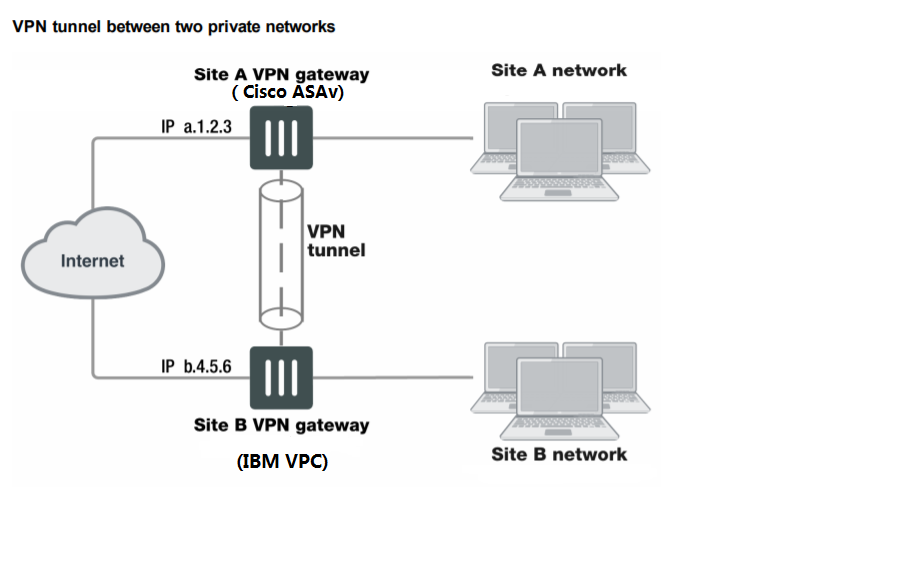
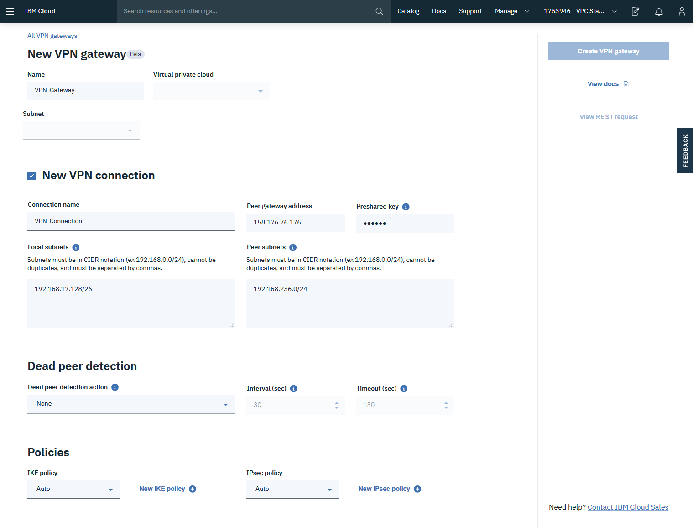

---

copyright:
  years: 2018, 2019
lastupdated: "2019-05-14"

keywords: peering, Cisco, ASAv, connection, secure, remote, vpc, vpc network

subcollection: vpc-on-classic-network

---

{:shortdesc: .shortdesc}
{:new_window: target="_blank"}
{:DomainName: data-hd-keyref="DomainName"}
{:note: .note}
{:important: .important}
{:deprecated: .deprecated}
{:generic: data-hd-programlang="generic"}

# Creating a secure connection with a remote Cisco ASAv peer
{: #creating-a-secure-connection-with-a-remote-cisco-asav-peer}

This document is based on Cisco ASAv, Cisco Adaptive Security Appliance Software Version 9.10(1).

The example steps that follow skip the prerequisite steps of using {{site.data.keyword.cloud}} API or CLI to create Virtual Private Clouds. For more information, see [Getting Started](/docs/vpc-on-classic?topic=vpc-on-classic-getting-started) and [VPC setup with APIs](/docs/vpc-on-classic?topic=vpc-on-classic-creating-a-vpc-using-the-rest-apis).

## Example steps
{: #cisco-example-steps}

The topology for connecting to the remote Cisco ASAv peer is similar to creating a VPN connection between two {{site.data.keyword.cloud}} Virtual Private Clouds. However, one side is replaced by the Cisco ASAv unit.



### To create a secure connection with the remote Cisco ASAv peer
{: #to-create-a-secure-connection-with-the-remote-cisco-asav-peer}

The first step in configuring your Cisco ASA for use with the IBM VPC VPN is to
ensure that the following prerequisite conditions have been set:

* Cisco ASAv is online and functional with a proper license
* A password for the Cisco ASAv is enabled
* There's at least one configured and verified functional internal interface
* There's at least one configured and verified functional external interface

When a Cisco ASAv unit receives a connection request from a remote VPN peer, it uses IPsec Phase 1 parameters to establish a secure connection and authenticate that VPN peer. Then, if the security policy permits the connection, the Cisco ASAv establishes the tunnel using IPsec Phase 1 parameters and applies the IPsec security policy. Key management, authentication, and security services are negotiated dynamically through the IKE protocol.

**To support these functions, the following general configuration steps must be performed by the Cisco ASAv unit:**

* Define the Phase 1 parameters that the Cisco ASAv unit requires to authenticate the remote peer and establish a secure connection.
* Define the Phase 2 parameters that the Cisco ASAv unit requires to create a VPN tunnel with the remote peer.

Create an Internet Key Exchange (IKE) version 2 proposal object. IKEv2 proposal objects
contain the parameters required for creating IKEv2 proposals when defining remote access and
site-to-site VPN policies. IKE is a key management protocol that facilitates the management of
IPsec-based communications. It is used to authenticate IPsec peers, negotiate and distribute
IPsec encryption keys, and automatically establish IPsec security associations (SAs).

```
group-policy GroupPolicy_161.156.80.10 internal
group-policy GroupPolicy_161.156.80.10 attributes
 vpn-tunnel-protocol ikev1 ikev2
tunnel-group 161.156.80.10 type ipsec-l2l
tunnel-group 161.156.80.10 general-attributes
 default-group-policy GroupPolicy_161.156.80.10
tunnel-group 161.156.80.10 ipsec-attributes
 ikev1 pre-shared-key <key value>
 ikev2 remote-authentication pre-shared-key <key value>
 ikev2 local-authentication pre-shared-key <key value>
```

Create an IKEv2 policy configuration for the IPsec connection. The IKEv2 policy block sets the
parameters for the IKE exchange. In this block, the following parameters are set:
* Encryption algorithm - set to AES-256 for this example
* Integrity algorithm - set to SHA256 for this example
* Diffie-Hellman group - IPsec uses the Diffie-Hellman algorithm to generate the initial
encryption key between the peers. In this example it is set to group 14
* Pseudo-Random Function (PRF) - IKEv2 requires a separate method used as the
algorithm to derive keying material and hashing operations required for the IKEv2 tunnel
encryption. This is referred to as the pseudo-random function and is set to SHA
* SA Lifetime - set the lifetime of the security associations (after which a reconnection will
occur). Set to 36,000 seconds.
* Operation type - keep this as the default value, bi-directional. (It's not explicit in the "show running" display.)

As shown in the following code example, this sample policy uses AES-256 to encrypt the secure channel. The SHA512
hash algorithm is used to validate the identity of the remote peer, and Diffie-Hellman group
14 is utilized for key generation. Group 14 uses 2048 bit encryption blocks. Finally, a
lifetime for the security association is set to 36,000 seconds.

```
crypto ikev2 policy 100
encryption aes-256
integrity sha-1
group 14
prf sha
lifetime seconds 36000
```

* Define the access list and crypto map for VPN:

```
access-list outside_cryptomap_1 extended permit ip object NETWORK_OBJ_192.168.236.0_24 object vpc
crypto map outside_map 1 match address outside_cryptomap_1
crypto map outside_map 1 set peer 161.156.80.10
crypto map outside_map 1 set ikev1 transform-set ESP-AES-128-SHA ESP-AES-128-MD5 ESP-AES-192-SHA ESP-AES-192-MD5 ESP-AES-256-SHA ESP-AES-256-MD5 ESP-3DES-SHA ESP-3DES-MD5 ESP-DES-SHA ESP-DES-MD5
crypto map outside_map 1 set ikev2 ipsec-proposal AES256 AES192 AES 3DES DES
crypto map outside_map interface outside
nat (any,outside) source static NETWORK_OBJ_192.168.236.0_24 NETWORK_OBJ_192.168.236.0_24 destination static vpc vpc no-proxy-arp route-lookup
```

## To create a secure connection with the local IBM Cloud VPC
{: #to-create-a-secure-connection-with-the-local-ibm-cloud-vpc}

To create a secure connection, you'll create the VPN connection within your VPC, which is similar to the 2 VPC example.

* Create a VPN gateway on your VPC subnet  along with a VPN connection between the VPC and the Cisco ASAv, setting `local_cidrs` to the subnet value on the VPC, and `peer_cidrs` to the subnet value on the Cisco ASAv.

The gateway status appears as `pending` while the VPN gateway is being created, and the status becomes `available` once creation is complete. Creation may take some time.
{:note}




### Check the status of the secure connection
{: #cisco-check-the-status-of-the-secure-connection}

You can check the status of your connection through the IBM Cloud console. Also, you could try to do a `ping` from site to site using the VSIs.


